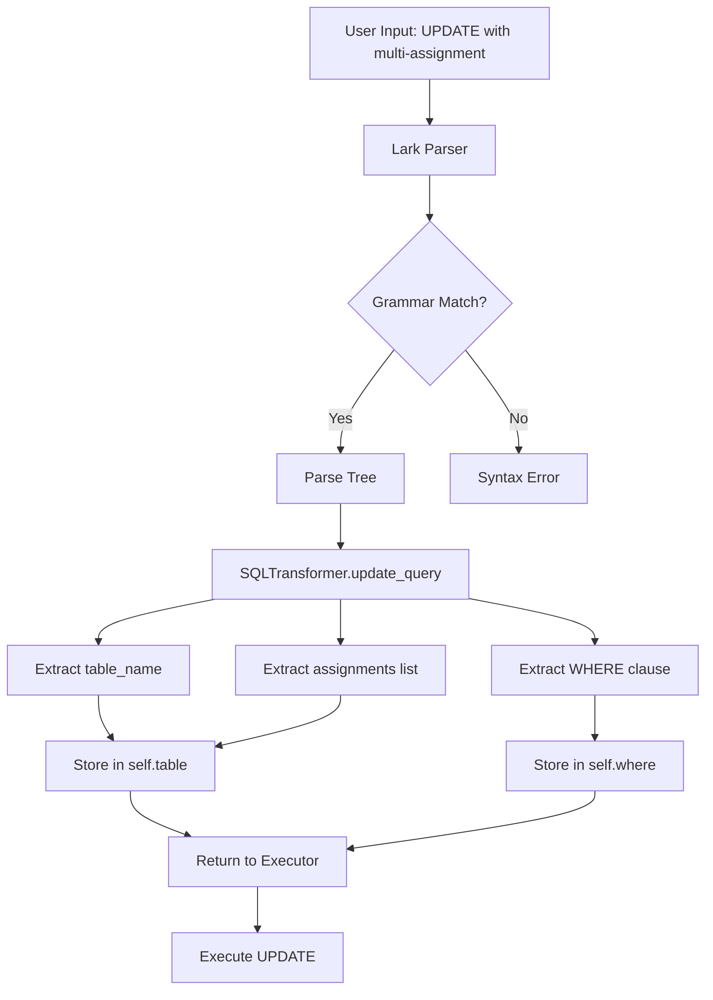
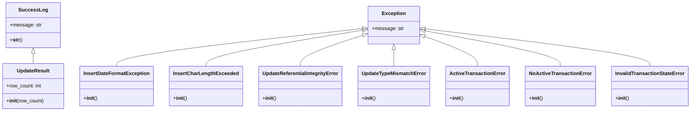

# Issue #1: Phase 0: Foundation - Add Exception Classes and Grammar Updates

## Summary

Implement foundational changes required before Phase 1 (Type Checking & UPDATE) and Phase 3 (Transactions). This includes adding 10 new exception classes to `messages.py` and updating the UPDATE grammar in `grammar.lark` and `sql_transformer.py` to support multiple column assignments.

## Root Cause Analysis

**Current State:**
- The UPDATE statement only supports single column assignment (e.g., `UPDATE table SET col1 = val1 WHERE ...`)
- Missing exception classes for type checking validation (date format, char length) and transaction management
- No proper success logging for UPDATE operations with row counts

**Desired State:**
- Support multi-column UPDATE: `UPDATE table SET col1 = val1, col2 = val2 WHERE ...`
- Comprehensive exception hierarchy for all validation scenarios
- Transaction state management exceptions

## Proposed Solution

1. **Exception Classes**: Add 10 new exception classes to `messages.py` organized by phase:
   - 5 for Type Checking (Phase 1.1)
   - 5 for Transactions (Phase 3.1)

2. **Grammar Updates**: Modify `grammar.lark` to accept comma-separated assignments in UPDATE statements

3. **Transformer Updates**: Update `sql_transformer.py` to handle multi-assignment parsing and return column assignments as a list of tuples

## Files to Modify

| File | Change |
|------|--------|
| `messages.py` | Add 10 new exception classes (5 for type checking, 5 for transactions) |
| `grammar.lark` (line 152) | Update `update_query` rule to support multiple assignments |
| `sql_transformer.py` (line 249) | Update `update_query` method to handle multi-assignment and return structured data |

## New Files

No new files required - all changes are modifications to existing files.

## Implementation Steps

### Step 1: Add Exception Classes to messages.py

Add the following classes after line 151 (after `InsertReferentialIntegrityError`):

**Type Checking Exceptions:**
1. `InsertDateFormatException` - Raised when date string doesn't match YYYY-MM-DD format
2. `InsertCharLengthExceeded` - Raised when string exceeds char(N) column length
3. `UpdateReferentialIntegrityError` - Raised when FK constraint violated on UPDATE
4. `UpdateTypeMismatchError` - Raised when type mismatch occurs on UPDATE
5. `UpdateResult` (SuccessLog) - Success message with row count for UPDATE operations

**Transaction Exceptions:**
6. `ActiveTransactionError` - Raised when attempting nested BEGIN
7. `NoActiveTransactionError` - Raised when COMMIT/ROLLBACK without active BEGIN
8. `InvalidTransactionStateError` - Raised for invalid transaction operations

### Step 2: Update Grammar (grammar.lark)

Replace line 152:
```lark
// OLD (single assignment only)
update_query : UPDATE table_name SET assignment [where_clause]

// NEW (multiple assignments)
update_query : UPDATE table_name SET assignment ("," assignment)* [where_clause]
assignment : column_name EQUAL value
```

### Step 3: Update Transformer (sql_transformer.py)

Replace the `update_query` method (lines 249-251) to:
1. Parse multiple assignments from the tree
2. Store table name and assignments list
3. Return structured data for the executor to process

```python
def update_query(self, items):
    self.statement = items[0].lower()
    self.table = {
        "table_name": items[1],
        "set_columns": items[3]  # List of (column_name, value) tuples
    }
    self.where = items[4] if len(items) > 4 else None
    return items
```

## Test Strategy

### Unit Tests
- **Exception instantiation**: Verify all 10 new exception classes can be instantiated with correct messages
- **Grammar parsing**: Test single and multi-assignment UPDATE statements parse correctly
- **Transformer output**: Verify transformer returns correct structure for both single and multi-assignment

### Integration Tests
- **Backward compatibility**: Existing single-assignment UPDATE queries continue to work
- **Multi-assignment**: New multi-assignment UPDATE queries parse and transform correctly

### Edge Cases
- Single assignment (backward compatibility)
- Two assignments
- Multiple assignments (3+)
- UPDATE without WHERE clause
- UPDATE with complex WHERE conditions

## Test Cases

```sql
-- Test Case 1: Single assignment (backward compatibility)
UPDATE account SET branch_name = 'Downtown' WHERE account_number = 9732;

-- Test Case 2: Two assignments
UPDATE account SET branch_name = 'Downtown', balance = 500 WHERE account_number = 9732;

-- Test Case 3: Multiple assignments
UPDATE account SET branch_name = 'Downtown', balance = 500, account_type = 'checking' WHERE account_number = 9732;

-- Test Case 4: UPDATE without WHERE
UPDATE account SET balance = 0;

-- Test Case 5: UPDATE with complex WHERE
UPDATE account SET branch_name = 'Main', balance = 1000 WHERE account_number = 9732 AND balance < 500;
```

## Risks & Mitigations

| Risk | Mitigation |
|------|------------|
| Grammar change breaks existing UPDATE parsing | Test with existing single-assignment queries first; ensure backward compatibility |
| Transformer returns incorrect structure for multi-assignment | Add unit tests for transformer output with 1, 2, and N assignments |
| Exception classes don't follow existing naming conventions | Follow existing pattern: inherit from `Exception` for errors, `SuccessLog` for success messages |
| WHERE clause handling in multi-assignment UPDATE | Verify transformer correctly handles optional WHERE clause with multiple assignments |

## Diagrams

### Data Flow: UPDATE Query Processing



### Exception Hierarchy



## Acceptance Criteria

- [ ] All 10 exception classes added to `messages.py`
- [ ] Grammar accepts multi-assignment UPDATE statements
- [ ] Grammar remains backward compatible with single-assignment UPDATE
- [ ] Transformer correctly parses and returns multi-assignment structure
- [ ] All existing test cases continue to pass
- [ ] New test cases for multi-assignment UPDATE pass

## References

- Issue URL: https://github.com/thynameisjibi/SQL-DBMS/issues/1
- Original IMPLEMENTATION_PLAN.md Phase 0 specification
