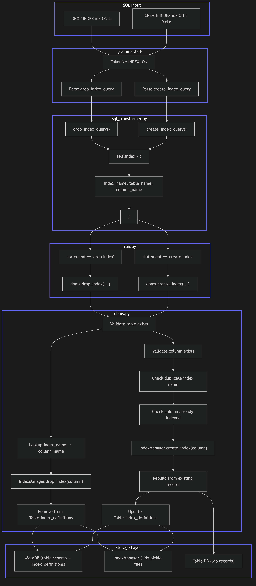

# Issue #14 – Add CREATE INDEX / DROP INDEX SQL Syntax and Index Test Suite

## Summary

The DBMS already has programmatic index infrastructure (`HashIndex`, `IndexManager`) integrated into `INSERT`/`DELETE`/`UPDATE` operations. However, indexes can only be created via direct Python API calls. This issue adds full SQL grammar support for `CREATE INDEX` and `DROP INDEX` statements, wires them through the transformer and dispatcher, extends the `Table` schema to track named index definitions, and delivers a comprehensive SQL-level test suite.

---

## Root Cause Analysis

| Aspect | Current State | Desired State |
|--------|--------------|---------------|
| **Grammar** | No `INDEX` or `ON` tokens; no `create_index_query` / `drop_index_query` rules | Full `CREATE INDEX idx ON t (col)` and `DROP INDEX idx ON t` syntax |
| **Transformer** | No methods to extract index_name, table_name, column_name from parse tree | `create_index_query` and `drop_index_query` transformers that populate `self.statement`, `self.table`, and a new `self.index` dict |
| **Dispatcher** (`run.py`) | No branches for `create index` / `drop index` | Wire to `dbms.create_index()` / `dbms.drop_index()` with proper error handling |
| **Schema** (`db_model.py`) | `Table.indexed_columns` is a `Set[str]` tracking only column names | `Table.index_definitions` is a `Dict[str, str]` mapping `index_name → column_name` to support SQL-standard named indexes |
| **DBMS API** (`dbms.py`) | `create_index(table_name, column_name)` and `drop_index(table_name, column_name)` accept only column names | Signatures extended to `(table_name, index_name, column_name)` and `(table_name, index_name)` respectively, with name→column resolution |
| **Error Messages** (`messages.py`) | No index-specific exceptions | `DuplicateIndexError`, `IndexExistenceError`, `NoSuchIndexError` |
| **Tests** | `test_index.py` (unit) and `test_dbms_index.py` (integration) cover programmatic API only | New `test_index_sql.py` covering end-to-end SQL parsing → execution |

The core gap is that the existing infrastructure treats indexes as **anonymous column indexes**, while SQL requires **named indexes**. Dropping by name (`DROP INDEX idx_name ON t`) is impossible without storing the name→column mapping.

---

## Proposed Solution

1. **Extend the grammar** with `INDEX` and `ON` tokens and two new query rules.
2. **Extend the transformer** to extract `index_name`, `table_name`, and `column_name` into a new `self.index` dictionary.
3. **Extend `Table`** in `db_model.py` with an `index_definitions` dictionary and accessor methods.
4. **Extend `DBMS` methods** to accept `index_name`, validate uniqueness, persist the mapping, and resolve names on drop.
5. **Add index-specific exceptions** to `messages.py` with consistent formatting.
6. **Wire `run.py`** to dispatch the new statements and catch the new exceptions.
7. **Create `test_index_sql.py`** as an end-to-end SQL test suite.

---

## Files to Modify

| File | Change |
|------|--------|
| `grammar.lark` | Add `INDEX` and `ON` keywords; add `create_index_query` and `drop_index_query` rules to `query` alternative |
| `sql_transformer.py` | Add `create_index_query()`, `drop_index_query()`, `index_name()` transformer methods; initialize `self.index` dict |
| `run.py` | Add `elif` branches for `create index` and `drop index`; wire to `dbms.create_index()` / `dbms.drop_index()`; add new exceptions to the catch block |
| `db_model.py` | Add `index_definitions: Dict[str, str]` to `Table.__init__`; add `add_index_definition()`, `remove_index_definition()`, `get_index_column()`, `has_index_name()` methods |
| `dbms.py` | Extend `create_index(self, table_name, index_name, column_name)` to validate and store named mapping; extend `drop_index(self, table_name, index_name)` to resolve name→column; update `drop_table()` to clean up `index_definitions` |
| `messages.py` | Add `CreateIndexSuccess`, `DropIndexSuccess`, `DuplicateIndexError`, `IndexExistenceError`, `NoSuchIndexError` |

## New Files

| File | Purpose |
|------|---------|
| `test_index_sql.py` | End-to-end SQL test suite: parse → transform → execute `CREATE INDEX` / `DROP INDEX`; covers insert/delete with index, search, range search, persistence, and all error cases |

---

## Implementation Steps

### Step 1 – Grammar Extension (`grammar.lark`)

```lark
// New tokens
INDEX : "index"i
ON    : "on"i

// Extend query rule
query : create_table_query
      | drop_table_query
      | create_index_query      // NEW
      | drop_index_query        // NEW
      | explain_query
      | ...

// CREATE INDEX
create_index_query : CREATE INDEX index_name ON table_name LP column_name RP

// DROP INDEX
drop_index_query : DROP INDEX index_name ON table_name

index_name : IDENTIFIER
```

> **Risk Mitigation:** Place `create_index_query` / `drop_index_query` after `drop_table_query` and before `explain_query` to avoid Lark ambiguity. `CREATE INDEX` and `CREATE TABLE` diverge at token 3 (`INDEX` vs `TABLE`), so no SLL conflict exists.

### Step 2 – Transformer Extension (`sql_transformer.py`)

Add to `__init__`:
```python
self.index = {
    "index_name": str(),
    "table_name": str(),
    "column_name": str(),
}
```

Add methods:
```python
def create_index_query(self, items):
    # items: [CREATE, INDEX, index_name, ON, table_name, '(', column_name, ')']
    self.statement = "create index"
    self.index["index_name"] = items[2]
    self.index["table_name"] = items[4]
    self.index["column_name"] = items[6]
    self.table = {"table_name": items[4]}
    return items

def drop_index_query(self, items):
    # items: [DROP, INDEX, index_name, ON, table_name]
    self.statement = "drop index"
    self.index["index_name"] = items[2]
    self.index["table_name"] = items[4]
    self.table = {"table_name": items[4]}
    return items

def index_name(self, items) -> str:
    return items[0].value.lower()
```

Update `command()` return signature to include `self.index`:
```python
return self.statement, self.table, self.record, self.tables, self.select_columns, self.where, self.index
```

### Step 3 – Messages Extension (`messages.py`)

```python
class CreateIndexSuccess(SuccessLog):
    def __init__(self, index_name, table_name, column_name):
        super().__init__(f"Index '{index_name}' created on '{table_name}({column_name})'")

class DropIndexSuccess(SuccessLog):
    def __init__(self, index_name, table_name):
        super().__init__(f"Index '{index_name}' dropped from '{table_name}'")

class DuplicateIndexError(Exception):
    """Raised when creating an index that already exists."""
    def __init__(self, index_name):
        super().__init__(f"Create index has failed: '{index_name}' already exists")

class NoSuchIndexError(Exception):
    """Raised when dropping a non-existent index."""
    def __init__(self, index_name):
        super().__init__(f"Drop index has failed: '{index_name}' does not exist")

class IndexExistenceError(Exception):
    """Raised when creating an index on a column that already has an index."""
    def __init__(self, column_name):
        super().__init__(f"Create index has failed: column '{column_name}' is already indexed")
```

### Step 4 – DB Model Extension (`db_model.py`)

Extend `Table.__init__`:
```python
def __init__(
    self, 
    table_name: str, 
    columns: Dict[str, str], 
    not_null_keys: Set[str], 
    primary_key: Tuple[str], 
    foreign_keys: Dict[str, Tuple[str, str]],
    referenced_by: Set[str]=set(),
    indexed_columns: Set[str]=None,
    index_definitions: Dict[str, str]=None  # NEW: index_name -> column_name
):
    ...
    self.index_definitions = index_definitions or {}
```

Add methods:
```python
def add_index_definition(self, index_name: str, column_name: str):
    self.index_definitions[index_name] = column_name
    self.indexed_columns.add(column_name)

def remove_index_definition(self, index_name: str):
    column_name = self.index_definitions.pop(index_name, None)
    if column_name and column_name not in self.index_definitions.values():
        self.indexed_columns.discard(column_name)

def get_index_column(self, index_name: str) -> Optional[str]:
    return self.index_definitions.get(index_name)

def has_index_name(self, index_name: str) -> bool:
    return index_name in self.index_definitions
```

Update `__str__` to show index information in the key column (e.g., `PRI/FOR/IDX`).

### Step 5 – DBMS Extension (`dbms.py`)

Modify `create_index` signature and logic:
```python
def create_index(self, table_name: str, index_name: str, column_name: str):
    self.meta_db.open_db()
    table_key = self.meta_db.create_key_from_value(table_name)
    table = self.meta_db.get(table_key)
    if not table:
        self.meta_db.close_db()
        raise NoSuchTable()
    if column_name not in table.columns:
        self.meta_db.close_db()
        raise NonExistingColumnDefError(column_name)
    if table.has_index_name(index_name):
        self.meta_db.close_db()
        raise DuplicateIndexError(index_name)
    if table.is_indexed(column_name):
        self.meta_db.close_db()
        raise IndexExistenceError(column_name)
    self.meta_db.close_db()
    
    index_manager = self._get_index_manager(table_name)
    if not index_manager.create_index(column_name):
        raise IndexExistenceError(column_name)
    
    # Rebuild from existing data
    table_db = DB(table_name, self.db_dir)
    table_db.open_db()
    records = []
    cursor = table_db.create_cursor()
    kvp = cursor.first()
    while kvp:
        key, value = kvp
        record = Record.deserialize(value)
        if column_name in record.data:
            records.append((record.data[column_name], key))
        kvp = cursor.next()
    table_db.discard_cursor(cursor)
    table_db.close_db()
    index_manager.rebuild_index(column_name, records)
    
    # Update metadata
    self.meta_db.open_db()
    table = self.meta_db.get(table_key)
    if table:
        table.add_index_definition(index_name, column_name)
        self.meta_db.put(table_key, table)
    self.meta_db.close_db()
    
    return CreateIndexSuccess(index_name, table_name, column_name)
```

Modify `drop_index` signature and logic:
```python
def drop_index(self, table_name: str, index_name: str):
    self.meta_db.open_db()
    table_key = self.meta_db.create_key_from_value(table_name)
    table = self.meta_db.get(table_key)
    if not table:
        self.meta_db.close_db()
        raise NoSuchTable()
    if not table.has_index_name(index_name):
        self.meta_db.close_db()
        raise NoSuchIndexError(index_name)
    column_name = table.get_index_column(index_name)
    self.meta_db.close_db()
    
    index_manager = self._get_index_manager(table_name)
    if not index_manager.drop_index(column_name):
        raise NoSuchIndexError(index_name)
    
    # Update metadata
    self.meta_db.open_db()
    table = self.meta_db.get(table_key)
    if table:
        table.remove_index_definition(index_name)
        self.meta_db.put(table_key, table)
    self.meta_db.close_db()
    
    return DropIndexSuccess(index_name, table_name)
```

Update `drop_table` to also clean `index_definitions` metadata (already cleans index file; metadata cleanup is implicit via table deletion).

### Step 6 – Dispatcher Wiring (`run.py`)

Update parse return unpacking:
```python
statement, table, record, tables, select_columns, where, index = parse_query(...)
```

Add branches:
```python
elif statement == "create index":
    result = dbms.create_index(
        table["table_name"],
        index["index_name"],
        index["column_name"]
    )
    print(PROMPT + str(result))
elif statement == "drop index":
    result = dbms.drop_index(
        table["table_name"],
        index["index_name"]
    )
    print(PROMPT + str(result))
```

Add new exceptions to the `except` tuple.

### Step 7 – SQL Test Suite (`test_index_sql.py`)

```python
"""End-to-end SQL tests for CREATE INDEX / DROP INDEX."""
import unittest
from pathlib import Path
import shutil
from lark import Lark

from run import parse_query
from sql_transformer import SQLTransformer
from dbms import DBMS
from messages import *

class TestIndexSQL(unittest.TestCase):
    @classmethod
    def setUpClass(cls):
        with open('grammar.lark') as f:
            cls.sql_parser = Lark(f.read(), start="command", lexer="basic")
    
    def setUp(self):
        self.test_dir = Path("./test_db_sql_index")
        if self.test_dir.exists():
            shutil.rmtree(self.test_dir)
        self.test_dir.mkdir(exist_ok=True)
        self.dbms = DBMS()
        self.dbms.db_dir = self.test_dir
    
    def tearDown(self):
        if self.test_dir.exists():
            shutil.rmtree(self.test_dir, ignore_errors=True)
    
    def _run_sql(self, sql):
        transformer = SQLTransformer()
        statement, table, record, tables, select_columns, where, index = parse_query(
            self.sql_parser, transformer, sql
        )
        if statement == "create index":
            return self.dbms.create_index(table["table_name"], index["index_name"], index["column_name"])
        elif statement == "drop index":
            return self.dbms.drop_index(table["table_name"], index["index_name"])
        elif statement == "create table":
            return self.dbms.create_table(table)
        elif statement == "insert":
            return self.dbms.insert(table, record)
        elif statement == "delete":
            return self.dbms.delete(table["table_name"], where)
        elif statement == "select":
            return self.dbms.select(tables, select_columns, where)
        elif statement == "drop table":
            return self.dbms.drop_table(table["table_name"])
        else:
            raise ValueError(f"Unknown statement: {statement}")
    
    def test_create_index_sql(self):
        self._run_sql("CREATE TABLE t (id INT, name CHAR(20), PRIMARY KEY (id));")
        result = self._run_sql("CREATE INDEX idx_name ON t (name);")
        self.assertIn("created", str(result).lower())
    
    def test_drop_index_sql(self):
        self._run_sql("CREATE TABLE t (id INT, name CHAR(20), PRIMARY KEY (id));")
        self._run_sql("CREATE INDEX idx_name ON t (name);")
        result = self._run_sql("DROP INDEX idx_name ON t;")
        self.assertIn("dropped", str(result).lower())
    
    def test_insert_updates_index(self):
        self._run_sql("CREATE TABLE t (id INT, name CHAR(20), PRIMARY KEY (id));")
        self._run_sql("CREATE INDEX idx_name ON t (name);")
        self._run_sql("INSERT INTO t VALUES (1, 'Alice');")
        self._run_sql("INSERT INTO t VALUES (2, 'Bob');")
        self._run_sql("INSERT INTO t VALUES (3, 'Alice');")
        im = self.dbms._get_index_manager("t")
        self.assertEqual(len(im.search("name", "Alice")), 2)
    
    def test_delete_updates_index(self):
        self._run_sql("CREATE TABLE t (id INT, name CHAR(20), PRIMARY KEY (id));")
        self._run_sql("CREATE INDEX idx_name ON t (name);")
        self._run_sql("INSERT INTO t VALUES (1, 'Alice');")
        self._run_sql("INSERT INTO t VALUES (2, 'Bob');")
        self._run_sql("DELETE FROM t WHERE id = 1;")
        im = self.dbms._get_index_manager("t")
        self.assertEqual(len(im.search("name", "Alice")), 0)
        self.assertEqual(len(im.search("name", "Bob")), 1)
    
    def test_range_search(self):
        self._run_sql("CREATE TABLE t (id INT, score INT, PRIMARY KEY (id));")
        self._run_sql("CREATE INDEX idx_score ON t (score);")
        for i in range(10):
            self._run_sql(f"INSERT INTO t VALUES ({i}, {i*10});")
        im = self.dbms._get_index_manager("t")
        result = im.range_search("score", 30, 60)
        self.assertEqual(len(result), 4)  # 30,40,50,60
    
    def test_persistence_across_restart(self):
        self._run_sql("CREATE TABLE t (id INT, tag CHAR(10), PRIMARY KEY (id));")
        self._run_sql("CREATE INDEX idx_tag ON t (tag);")
        self._run_sql("INSERT INTO t VALUES (1, 'red');")
        self._run_sql("INSERT INTO t VALUES (2, 'blue');")
        
        dbms2 = DBMS()
        dbms2.db_dir = self.test_dir
        im = dbms2._get_index_manager("t")
        self.assertTrue(im.has_index("tag"))
        self.assertEqual(len(im.search("tag", "red")), 1)
    
    def test_duplicate_index_error(self):
        self._run_sql("CREATE TABLE t (id INT, name CHAR(20), PRIMARY KEY (id));")
        self._run_sql("CREATE INDEX idx_name ON t (name);")
        with self.assertRaises(DuplicateIndexError):
            self._run_sql("CREATE INDEX idx_name ON t (name);")
    
    def test_index_on_nonexistent_column(self):
        self._run_sql("CREATE TABLE t (id INT, PRIMARY KEY (id));")
        with self.assertRaises(NonExistingColumnDefError):
            self._run_sql("CREATE INDEX idx ON t (nonexistent);")
    
    def test_index_on_nonexistent_table(self):
        with self.assertRaises(NoSuchTable):
            self._run_sql("CREATE INDEX idx ON nonexistent (col);")
    
    def test_drop_nonexistent_index(self):
        self._run_sql("CREATE TABLE t (id INT, PRIMARY KEY (id));")
        with self.assertRaises(NoSuchIndexError):
            self._run_sql("DROP INDEX idx ON t;")
    
    def test_drop_table_cleans_index(self):
        self._run_sql("CREATE TABLE t (id INT, name CHAR(20), PRIMARY KEY (id));")
        self._run_sql("CREATE INDEX idx_name ON t (name);")
        self._run_sql("INSERT INTO t VALUES (1, 'Alice');")
        self._run_sql("DROP TABLE t;")
        index_file = self.test_dir / "t_indexes.idx"
        self.assertFalse(index_file.exists())

if __name__ == "__main__":
    unittest.main()
```

---

## Test Strategy

| Layer | What to Test |
|-------|-------------|
| **Unit** | `HashIndex.insert/search/delete/range_search` — already covered by `test_index.py`; no changes needed |
| **Unit** | `IndexManager.create_index/drop_index/save/load` — already covered by `test_index.py`; no changes needed |
| **Integration** | `DBMS.create_index/drop_index` with metadata — already covered by `test_dbms_index.py`; update signatures |
| **End-to-End** | `test_index_sql.py`: SQL string → Lark parse → transformer → DBMS execution → assert state |

### Edge Cases Covered in `test_index_sql.py`

1. **Duplicate index name** – `CREATE INDEX idx_name ON t (name)` twice → `DuplicateIndexError`
2. **Column already indexed** – different name, same column → `IndexExistenceError`
3. **Non-existent column** – `CREATE INDEX idx ON t (bad_col)` → `NonExistingColumnDefError`
4. **Non-existent table** – `CREATE INDEX idx ON bad_table (col)` → `NoSuchTable`
5. **Drop non-existent index** – `DROP INDEX idx ON t` when no index → `NoSuchIndexError`
6. **Drop table cleans indexes** – `.idx` file removed, metadata gone
7. **Insert propagates to index** – `INSERT` after `CREATE INDEX` updates `IndexManager`
8. **Delete propagates to index** – `DELETE` removes from `IndexManager`
9. **Range search on hash index** – O(n) but functional; values 3-6 in 0-9 range
10. **Persistence across restart** – new `DBMS` instance loads `.idx` file, metadata shows index

---

## Risks & Mitigations

| Risk | Likelihood | Impact | Mitigation |
|------|-----------|--------|------------|
| **Grammar conflict with CREATE TABLE** | Low | High | Place new rules after `create_table_query`; divergence at token 3 (`INDEX` vs `TABLE`) guarantees no SLL ambiguity |
| **Transformer return signature change breaks existing tests** | Medium | Medium | Update `parse_query()` call in `run.py` and all test files that unpack the return value; grep for `parse_query` to find call sites |
| **Pickle compatibility with existing `.idx` files** | Low | Medium | `IndexManager.load_indexes()` already catches `pickle.UnpicklingError` and resets; `Table.index_definitions` is new but existing tables will have `None` default, handled gracefully |
| **Nested transaction + index DDL** | Low | Low | Current transaction log only covers DML (`INSERT`/`DELETE`/`UPDATE`). DDL (`CREATE TABLE`, `DROP TABLE`) is auto-committed. Index DDL will follow the same pattern; document this behavior |
| **Index name collision across tables** | Low | Low | Index names are scoped to a single table via `Table.index_definitions`, so `idx1` on `t1` and `t2` is allowed |

---

## Diagrams

### SQL Index Statement Flow



---

## Appendix: Grammar Diff Preview

```diff
+ INDEX : "index"i
+ ON    : "on"i

  query : create_table_query
        | drop_table_query
+       | create_index_query
+       | drop_index_query
        | explain_query
        | ...

+ create_index_query : CREATE INDEX index_name ON table_name LP column_name RP
+ drop_index_query   : DROP INDEX index_name ON table_name
+ index_name         : IDENTIFIER
```

## Appendix: Backward Compatibility

- Existing `.idx` files without `index_definitions` in `Table` metadata: `Table.__init__` uses `index_definitions=None` default → converts to `{}`. Index file itself is pickle-loaded normally by `IndexManager`.
- Existing programmatic calls to `DBMS.create_index(table_name, column_name)` will break due to signature change. Update call sites in `test_dbms_index.py` to pass `index_name` as positional arg 2.
