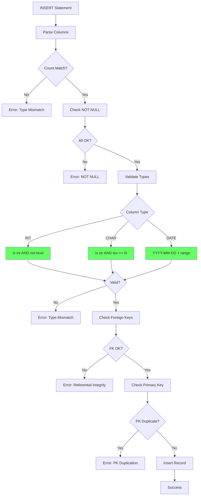

# Issue #2: Phase 1.1: Full Type & Constraint Checking

## Summary
Enhance INSERT validation in the SQL-DBMS to strictly enforce data types, NOT NULL constraints, CHAR(N) length limits, and date format validation with proper error handling.

## Root Cause Analysis
The current `is_valid_type()` function in `utils.py` (lines 58-69) has critical gaps:

1. **Boolean-as-integer bug**: Python bool is subclass of int, so `isinstance(True, int)` returns True
2. **No CHAR(N) length validation**: Values exceeding limits are silently truncated instead of rejected
3. **Weak date validation**: Regex accepts invalid dates like 2023-13-25
4. **Generic errors**: InsertTypeMismatchError provides no specifics

## Proposed Solution
1. Reject booleans for INT columns explicitly
2. Validate CHAR(N) length before insertion (not truncate after)
3. Strict date validation: month 01-12, day 01-31
4. Preserve existing NOT NULL checks in dbms.py lines 164-165

## Files to Modify
| File | Change |
|------|--------|
| utils.py | Rewrite is_valid_type() (lines 58-69) |
| dbms.py | Add CHAR length validation before line 167, remove truncation lines 174-176 |

## Implementation Steps

### Step 1: Enhance is_valid_type() in utils.py
```python
def is_valid_type(valid_type, value):
    if value is None:
        return True
    
    try:
        if valid_type == "int":
            return isinstance(value, int) and not isinstance(value, bool)
        
        elif valid_type.startswith("char"):
            if not isinstance(value, str):
                return False
            max_len = eval_char_max_len(valid_type)
            return len(value) <= max_len
        
        elif valid_type == "date":
            if not isinstance(value, str):
                return False
            match = re.match(DATE_PATTERN, value)
            if not match:
                return False
            year, month, day = int(match.group(1)), int(match.group(2)), int(match.group(3))
            return 1 <= month <= 12 and 1 <= day <= 31
    except (ValueError, AttributeError):
        return False
    
    return False
```

### Step 2: Update insert() in dbms.py
Add CHAR length validation before the is_valid_type check (around line 163-166) and remove truncation logic.

### Step 3: Test
Verify with issue test cases:
- INSERT with bool as int → FAIL
- INSERT with CHAR overflow → FAIL  
- INSERT with invalid date → FAIL
- Valid INSERT → PASS

## Test Strategy

### Unit Tests
- INT: 123 (pass), True (fail), "123" (fail)
- CHAR(5): "abc" (pass), "abcdef" (fail)
- DATE: "2023-12-25" (pass), "2023-13-25" (fail)

### Integration Tests
- Valid INSERT with all types
- Invalid INSERT with each violation type
- NULL handling for nullable vs NOT NULL

### Edge Cases
- Empty string in CHAR(N)
- Boundary length (exactly N chars)
- Date boundaries (01-12, 01-31)
- NULL values
- Negative integers

## Risks & Mitigations
| Risk | Mitigation |
|------|------------|
| Breaking existing code relying on truncation | Intentional - prevents silent data loss |
| Date validation complexity | Keep simple, enhance later if needed |
| Performance | Minimal - O(1) per column |

## Diagrams

### INSERT Validation Flow


