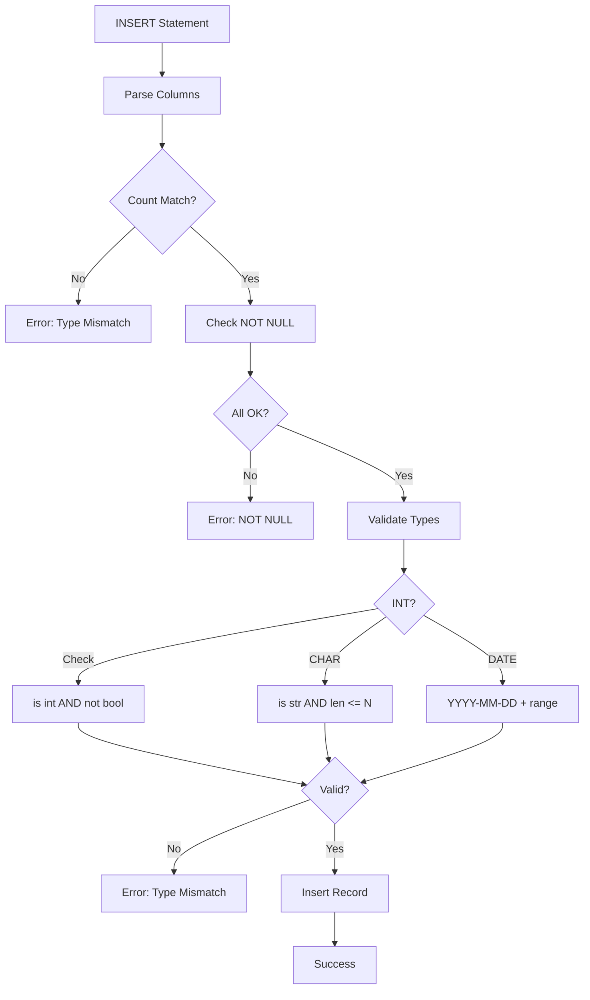

# Issue #2: Phase 1.1: Full Type and Constraint Checking

## Summary
Enhance INSERT validation in the SQL-DBMS to strictly enforce data types, NOT NULL constraints, CHAR(N) length limits, and date format validation.

## Root Cause Analysis
Current is_valid_type() in utils.py has gaps:
1. Accepts booleans as integers (Python bool is subclass of int)
2. No CHAR(N) length validation - silent truncation
3. Weak date validation - accepts 2023-13-25
4. Generic error messages

## Proposed Solution
1. Reject booleans for INT
2. Validate CHAR(N) length before insertion  
3. Strict date validation (month 01-12, day 01-31)

## Files to Modify
| File | Change |
|------|--------|
| utils.py | Rewrite is_valid_type() (lines 58-69) |
| dbms.py | Move CHAR validation before type check |

## Implementation Steps
1. Enhance is_valid_type() in utils.py
2. Update insert() in dbms.py  
3. Test changes

## Test Strategy
- Unit: is_valid_type() with INT, CHAR, DATE
- Integration: Full INSERT flow
- Edge cases: empty strings, boundaries, NULLs

## Risks
| Risk | Mitigation |
|------|------------|
| Breaking existing code | Prevents silent data loss |
| Performance | Minimal - O(1) per column |

## Diagrams

### INSERT Validation Flow

