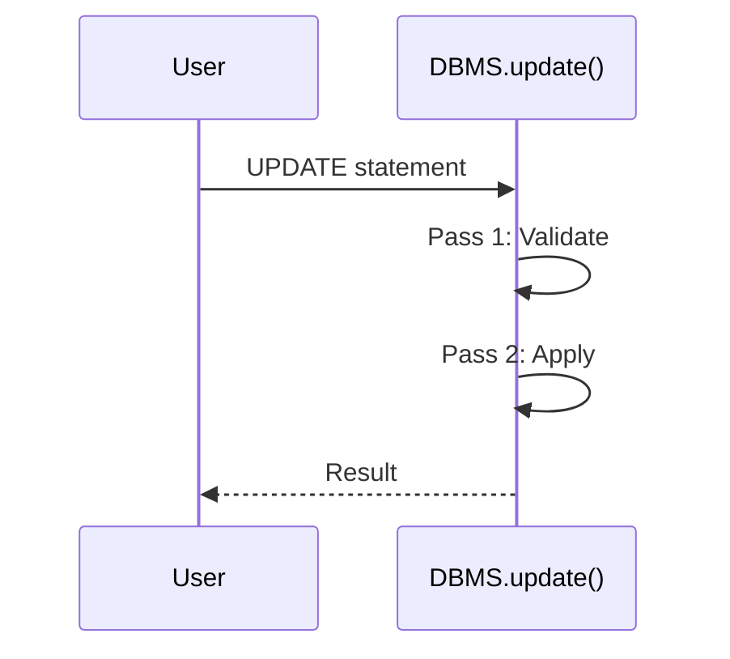

# Issue #3: Phase 1.2 - UPDATE Statement Implementation

## Summary

Implement the UPDATE statement with full constraint checking, supporting both single and multiple column assignments. This feature completes the CRUD operations by adding the missing UPDATE functionality to the SQL DBMS.

## Root Cause Analysis

**Current State:**
- The UPDATE grammar exists in `grammar.lark` (line 152) but only supports single assignment
- The `SQLTransformer.update_query()` method (sql_transformer.py lines 249-251) returns a placeholder string `"'UPDATE' requested"` instead of parsing the statement properly
- The `DBMS` class has no `update()` method
- The `run.py` dispatcher has no UPDATE statement handler

**Why This Issue Exists:**
The UPDATE statement was defined in the grammar as a stub during initial setup but was never implemented. The grammar currently only supports:
```lark
update_query : UPDATE table_name SET assignment [where_clause]
assignment : column_name EQUAL value
```

This needs to be extended to support multiple assignments and the full implementation pipeline.

additional

## Proposed Solution

Implement UPDATE following the same pattern as DELETE.

## Files to Modify

| File | Change |
|------|--------|
| grammar.lark | Lines 152-153 |
| sql_transformer.py | Lines 249-251 |
| dbms.py | After line 269 |
| run.py | Lines 47-54 |
| messages.py | Add exceptions |

## Implementation Steps

1. Update grammar to support multiple assignments
2. Implement update_query() transformer
3. Add UpdatePrimaryKeyError exception
4. Add UpdateResult success message
5. Implement DBMS.update() with two-pass validation
6. Add dispatcher in run.py

## Test Strategy

- Basic UPDATE without WHERE
- UPDATE with WHERE clause
- Multiple column assignments
- NOT NULL and PK constraints
- Foreign key validation

## Dependencies

- Blocks: Phase 3.1 (transactions)
- Blocked by: Phase 0 (assumed complete)

## Diagrams

### Execution Flow



## References

- Issue: https://github.com/thynameisjibi/SQL-DBMS/issues/3
