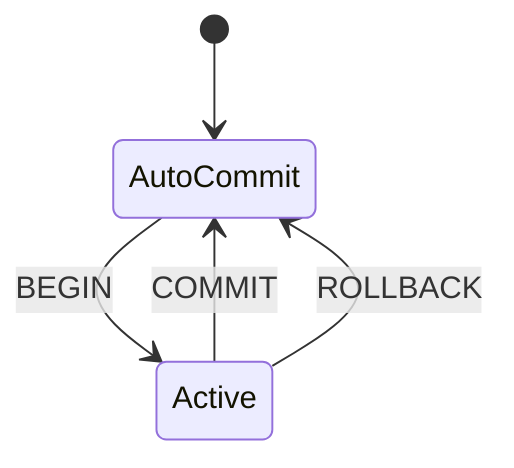

# Issue #5: Phase 3.1: Basic Transaction Support

## Summary

Implement ACID transaction support for INSERT/UPDATE/DELETE with undo logging and crash recovery.

**Scope:**
- INCLUDED: INSERT, UPDATE, DELETE
- EXCLUDED: Schema changes (auto-commit)

## Files to Modify

| File | Change |
|------|--------|
| transaction.py | NEW - TransactionManager |
| dbms.py | Add transaction support |
| messages.py | Error classes |
| db_model.py | Log classes |
| run.py | Command handlers |

## Implementation Steps

1. Create UndoLogEntry and TransactionLog classes
2. Create TransactionManager class
3. Integrate into DBMS
4. Add error handling
5. Update SQL grammar

## Diagrams

## Success Criteria

1. BEGIN/COMMIT/ROLLBACK work correctly
2. Rollback undoes all operations
3. Auto-commit works
4. Logs cleaned up after commit/rollback

## References

- IMPLEMENTATION_PLAN.md Phase 3.1
- ARIES transaction recovery algorithm
