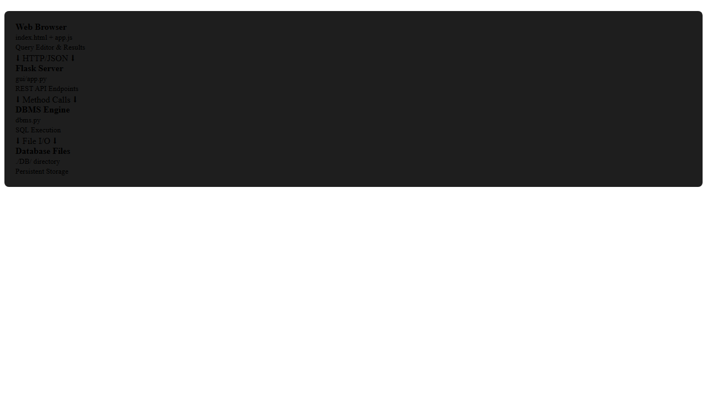
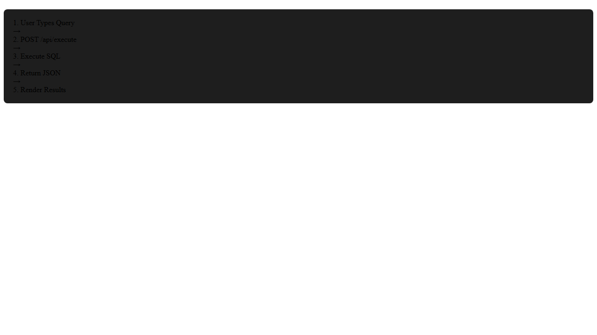
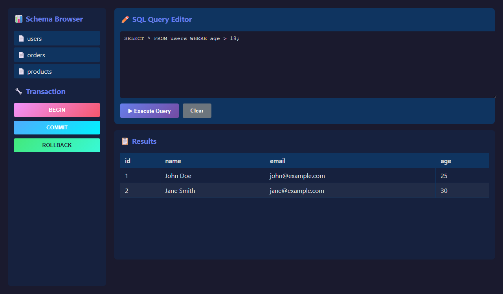

# Issue #6: Phase 4.1: Web-Based GUI

## Summary

Create a Flask-based web interface for the SQL DBMS that allows users to execute queries, view results, browse schema, and manage transactions through a browser, replacing the current CLI-only interface.

## Root Cause Analysis

**Current State:**
- The DBMS only has a CLI interface via `run.py`
- Users must interact through a terminal with no visual feedback
- No schema browser or result visualization
- Single-user, synchronous interaction model

**Desired State:**
- Web-based GUI accessible from any browser
- Visual query editor with syntax highlighting
- Tabular result display with formatting
- Schema browser showing all tables and their structure
- Transaction management interface
- Multi-user capable architecture

## Proposed Solution

Build a Flask web application with a single-page interface that:
1. Exposes the existing DBMS functionality through REST API endpoints
2. Provides a modern, responsive UI for query execution and schema browsing
3. Maintains a single shared DBMS instance across all requests
4. Uses client-side JavaScript for interactive features and real-time feedback

## Files to Modify

| File | Change |
|------|--------|
| `requirements.txt` | Add Flask and flask-cors dependencies |

## New Files

| File | Purpose |
|------|---------|
| `gui/app.py` | Flask application with API routes |
| `gui/templates/index.html` | Single-page HTML interface |
| `gui/static/style.css` | CSS styling for the UI |
| `gui/static/app.js` | Client-side JavaScript for API interaction |
| `gui/requirements.txt` | Flask-specific dependencies |

## Implementation Steps

### Step 1: Update Project Dependencies
Add Flask dependencies to the main `requirements.txt`:
```
lark==1.1.5
Flask==3.0.0
flask-cors==4.0.0
```

### Step 2: Create GUI Module Structure
```bash
mkdir -p gui/templates gui/static
```

### Step 3: Implement Flask Application (`gui/app.py`)
Create Flask app with routes:
- `GET /` - Serve main interface
- `POST /api/execute` - Execute SQL queries
- `GET /api/tables` - List all tables
- `GET /api/schema/<table_name>` - Get table schema
- `POST /api/transaction` - Transaction management (BEGIN, COMMIT, ROLLBACK)

### Step 4: Build HTML Interface (`gui/templates/index.html`)
Create single-page layout with:
- Query editor textarea with monospace font
- Execute button and transaction controls
- Results display area (table format)
- Schema browser sidebar
- Error message display

### Step 5: Style the Interface (`gui/static/style.css`)
Implement responsive design with:
- Dark theme matching terminal aesthetic
- Syntax highlighting colors for SQL keywords
- Tabular result styling
- Sidebar navigation for schema browser
- Error/warning state styling

### Step 6: Implement Client-Side Logic (`gui/static/app.js`)
Add JavaScript for:
- API call handling (fetch)
- Query execution and result rendering
- Schema browser population
- Transaction state management
- Error handling and user feedback
- Live query preview for SELECT queries (debounced)

### Step 7: Create GUI Requirements File
Create `gui/requirements.txt` with Flask-specific dependencies for easy deployment.

### Step 8: Test the Implementation
- Start Flask server
- Test query execution with various SQL statements
- Verify schema browser displays correct information
- Test transaction management
- Verify error handling and edge cases

## Test Strategy

### Unit Tests
- Flask route handlers return correct JSON responses
- Error cases return appropriate HTTP status codes (400, 404)
- DBMS instance is shared across requests

### Integration Tests
- End-to-end query execution flow
- Schema browser accurately reflects database state
- Transaction operations (BEGIN/COMMIT/ROLLBACK) work correctly

### Edge Cases
- Empty query submission
- Malformed SQL queries
- Concurrent query execution
- Large result sets
- Special characters in queries
- Network errors and timeouts

## Risks & Mitigations

| Risk | Mitigation |
|------|------------|
| **DBMS thread safety** - Flask may handle concurrent requests | Use threading locks around DBMS operations; document single-user limitation |
| **SQL injection** - Not applicable (user-provided SQL is intentional) | N/A - this is a SQL interface, not a web form |
| **Large result sets** - Memory issues with massive queries | Implement pagination or result size limits in future iterations |
| **State management** - Transaction state across requests | Use Flask sessions or client-side transaction state tracking |
| **Error exposure** - Internal errors leaked to UI | Implement error sanitization; show user-friendly messages |

## Diagrams

### Architecture Diagram



### Data Flow Diagram



### UI Layout Mockup



<!-- HTML_SOURCE_START
<!DOCTYPE html>
<html lang="en">
<head>
    <meta charset="UTF-8">
    <meta name="viewport" content="width=device-width, initial-scale=1.0">
    <title>SQL DBMS Web GUI Mockup</title>
    <style>
        body {
            font-family: -apple-system, BlinkMacSystemFont, 'Segoe UI', Roboto, sans-serif;
            background: #1a1a2e;
            color: #e0e0e0;
            margin: 0;
            padding: 20px;
        }
        .container {
            display: grid;
            grid-template-columns: 250px 1fr;
            gap: 20px;
            max-width: 1400px;
            margin: 0 auto;
        }
        .sidebar {
            background: #16213e;
            padding: 15px;
            border-radius: 8px;
            height: calc(100vh - 40px);
            overflow-y: auto;
        }
        .main-content {
            display: flex;
            flex-direction: column;
            gap: 15px;
        }
        .query-editor {
            background: #0f3460;
            border: 1px solid #1a1a2e;
            border-radius: 8px;
            padding: 15px;
        }
        textarea {
            width: 100%;
            height: 150px;
            background: #1a1a2e;
            color: #e0e0e0;
            border: none;
            border-radius: 4px;
            padding: 10px;
            font-family: 'Courier New', monospace;
            font-size: 14px;
            resize: vertical;
        }
        .button-row {
            display: flex;
            gap: 10px;
            margin-top: 10px;
        }
        button {
            background: linear-gradient(135deg, #667eea 0%, #764ba2 100%);
            color: white;
            border: none;
            padding: 10px 20px;
            border-radius: 4px;
            cursor: pointer;
            font-weight: 600;
        }
        button:hover {
            opacity: 0.9;
        }
        .results-panel {
            background: #16213e;
            border-radius: 8px;
            padding: 15px;
            min-height: 300px;
            overflow: auto;
        }
        table {
            width: 100%;
            border-collapse: collapse;
            margin-top: 10px;
        }
        th, td {
            border: 1px solid #0f3460;
            padding: 8px 12px;
            text-align: left;
        }
        th {
            background: #0f3460;
            font-weight: 600;
        }
        tr:nth-child(even) {
            background: rgba(255,255,255,0.05);
        }
        .table-list {
            list-style: none;
            padding: 0;
        }
        .table-list li {
            padding: 8px;
            margin: 5px 0;
            background: #0f3460;
            border-radius: 4px;
            cursor: pointer;
        }
        .table-list li:hover {
            background: #1a1a2e;
        }
        .error-message {
            background: #e74c3c;
            color: white;
            padding: 10px;
            border-radius: 4px;
            margin-top: 10px;
        }
        .success-message {
            background: #27ae60;
            color: white;
            padding: 10px;
            border-radius: 4px;
            margin-top: 10px;
        }
        h3 {
            margin-top: 0;
            color: #667eea;
        }
    </style>
</head>
<body>
    <div class="container">
        <div class="sidebar">
            <h3>📊 Schema Browser</h3>
            <ul class="table-list">
                <li>📄 users</li>
                <li>📄 orders</li>
                <li>📄 products</li>
            </ul>
            <div style="margin-top: 20px;">
                <h3>🔧 Transaction</h3>
                <div class="button-row" style="flex-direction: column;">
                    <button style="background: linear-gradient(135deg, #f093fb 0%, #f5576c 100%);">BEGIN</button>
                    <button style="background: linear-gradient(135deg, #4facfe 0%, #00f2fe 100%);">COMMIT</button>
                    <button style="background: linear-gradient(135deg, #43e97b 0%, #38f9d7 100%); color: #1a1a2e;">ROLLBACK</button>
                </div>
            </div>
        </div>
        <div class="main-content">
            <div class="query-editor">
                <h3>✏️ SQL Query Editor</h3>
                <textarea placeholder="Enter your SQL query here...&#10;&#10;Example:&#10;SELECT * FROM users WHERE age > 18;"></textarea>
                <div class="button-row">
                    <button>▶ Execute Query</button>
                    <button style="background: #6c757d;">Clear</button>
                </div>
            </div>
            <div class="results-panel">
                <h3>📋 Results</h3>
                <table>
                    <thead>
                        <tr>
                            <th>id</th>
                            <th>name</th>
                            <th>email</th>
                            <th>age</th>
                        </tr>
                    </thead>
                    <tbody>
                        <tr>
                            <td>1</td>
                            <td>John Doe</td>
                            <td>john@example.com</td>
                            <td>25</td>
                        </tr>
                        <tr>
                            <td>2</td>
                            <td>Jane Smith</td>
                            <td>jane@example.com</td>
                            <td>30</td>
                        </tr>
                    </tbody>
                </table>
            </div>
        </div>
    </div>
</body>
</html>
HTML_SOURCE_END -->

## Technical Specifications

### Flask Application Structure

```python
from flask import Flask, render_template, request, jsonify
from flask_cors import CORS
from dbms import DBMS
from run import parse_query, parse_query_sequence
from sql_transformer import SQLTransformer
from lark import Lark
from pathlib import Path

app = Flask(__name__)
CORS(app)

# Single shared DBMS instance
dbms = DBMS()

# Load SQL parser once at startup
parser_path = Path(__file__).parent.parent / 'grammar.lark'
with open(parser_path) as file:
    sql_parser = Lark(file.read(), start="command", lexer="basic")

@app.route('/')
def index():
    """Render main interface."""
    return render_template('index.html')

@app.route('/api/execute', methods=['POST'])
def execute_query():
    """Execute SQL query and return results."""
    query = request.json.get('query', '').strip()
    try:
        sql_transformer = SQLTransformer()
        statement, table, record, tables, select_columns, where = parse_query(
            sql_parser, sql_transformer, query
        )
        # Route to appropriate DBMS method
        # Return formatted result
    except Exception as e:
        return jsonify({'success': False, 'message': str(e)}), 400

@app.route('/api/tables', methods=['GET'])
def get_tables():
    """Get list of all tables."""
    tables = dbms.show_tables()
    return jsonify({'success': True, 'tables': parse_tables(tables)})

@app.route('/api/schema/<table_name>', methods=['GET'])
def get_schema(table_name):
    """Get schema for a table."""
    try:
        table = dbms.explain_describe_desc(table_name)
        return jsonify({'success': True, 'schema': str(table)})
    except NoSuchTable:
        return jsonify({'success': False, 'message': 'Table not found'}), 404
```

### API Response Format

**Success Response:**
```json
{
  "success": true,
  "data": {
    "headers": ["id", "name", "email"],
    "rows": [
      [1, "John", "john@example.com"],
      [2, "Jane", "jane@example.com"]
    ],
    "statement": "select",
    "message": "Query executed successfully"
  }
}
```

**Error Response:**
```json
{
  "success": false,
  "message": "Table 'users' does not exist",
  "error_type": "NoSuchTable"
}
```

## Deployment Instructions

### Local Development
```bash
cd gui
pip install -r requirements.txt
python app.py
# Access at http://localhost:5000
```

### Production Deployment
```bash
# Install gunicorn for production
pip install gunicorn

# Run with gunicorn
gunicorn -w 4 -b 0.0.0.0:5000 app:app
```

## Future Enhancements

- **Syntax Highlighting**: Integrate CodeMirror or Monaco Editor
- **Query History**: Store and display recent queries
- **Export Results**: CSV/JSON export functionality
- **User Authentication**: Multi-user support with access control
- **Query Visualization**: Chart/graph visualization for SELECT results
- **Auto-complete**: SQL keyword and table/column name suggestions
- **Transaction Isolation**: Proper transaction state management per session
